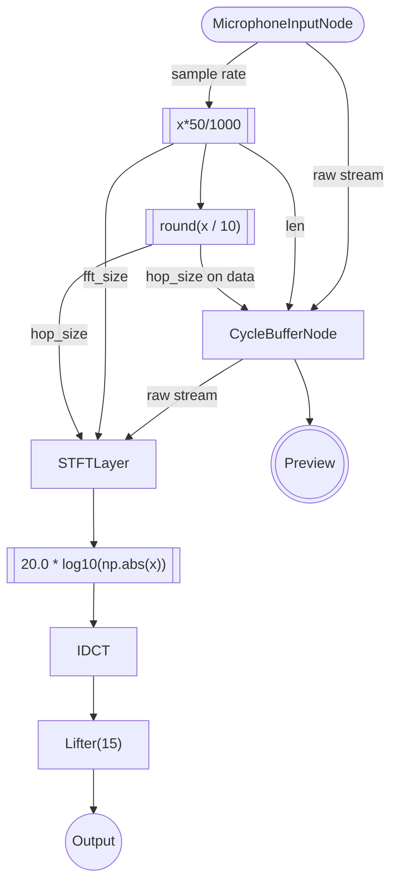
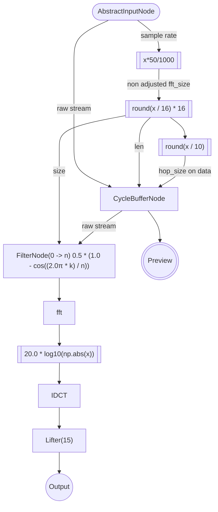

# 目標
## 現行実装
### 未実装
- IDCTNode
- LifterNode
- Patch about CycleBufferNode

```mermaid
flowchart TB
  MicrophoneInputNode([MicrophoneInputNode])-->|sample rate| CalcFFTSize[[x*50/1000]]
  MicrophoneInputNode-->|raw stream| CycleBufferNode
  CalcFFTSize-->|len|CycleBufferNode
  CalcFFTSize-->CalcHopSize[["round(x / 10)"]]
  CalcHopSize-->|hop_size on data|CycleBufferNode
  CycleBufferNode-->|raw stream|STFTLayer
  CalcFFTSize-->|fft_size|STFTLayer
  CalcHopSize-->|hop_size|STFTLayer
  CycleBufferNode-->Preview1(((Preview)))
  STFTLayer-->CalcPowerSpectrum[["20.0 * log10(np.abs(x))"]]
  CalcPowerSpectrum-->CalcQuefrency["IDCT"]
  CalcQuefrency-->Lifter["Lifter(15)"]
  Lifter-->OutputNode((Output))
```

## 最終実装
### 未実装
- FftNode
- FilterNode

```mermaid
flowchart TB
  MicrophoneInputNode([AbstractInputNode])-->|sample rate| AdjustCalcFFTSize[[x*50/1000]]
  AdjustCalcFFTSize-->|non adjusted fft_size| CalcFFTSize[["round(x / 16) * 16"]]
  MicrophoneInputNode-->|raw stream| CycleBufferNode
  CalcFFTSize-->|len|CycleBufferNode
  CalcFFTSize-->CalcHopSize[["round(x / 10)"]]
  CalcFFTSize-->|size|FilterNode
  CalcHopSize-->|hop_size on data|CycleBufferNode
  CycleBufferNode-->|raw stream|FilterNode["FilterNode(0 -> n) 0.5 * (1.0 - cos((2.0π * k) / n))"]
  CycleBufferNode-->Preview1(((Preview)))
  FilterNode-->CalcFFT["fft"]
  CalcFFT-->CalcPowerSpectrum[["20.0 * log10(np.abs(x))"]]
  CalcPowerSpectrum-->CalcQuefrency["IDCT"]
  CalcQuefrency-->Lifter["Lifter(15)"]
  Lifter-->OutputNode((Output))
```
